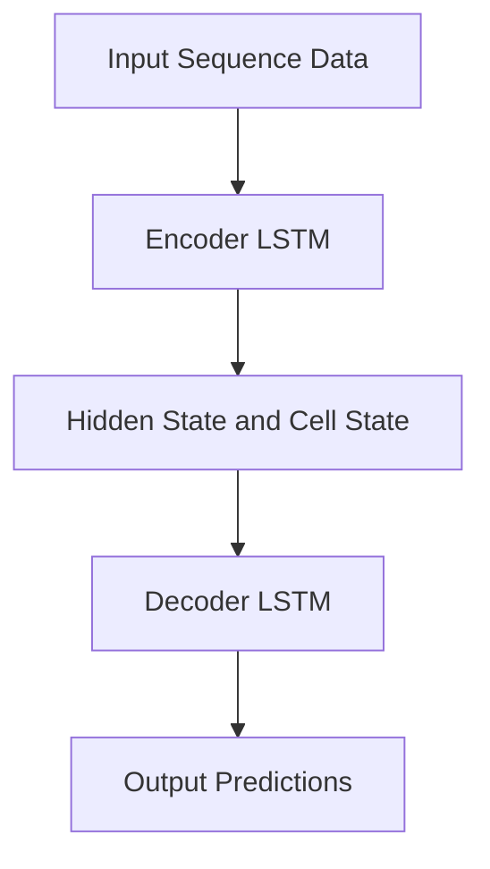
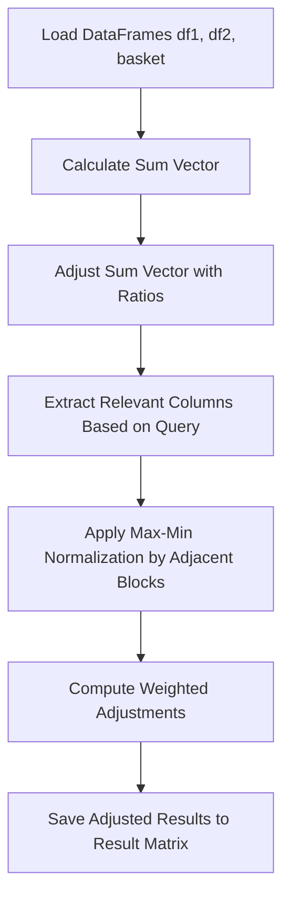

# Seq2SeqTraffic
LSTM based Google/Naver Feature Extraction

## Overview

This project implements an LSTM-based encoder-decoder model for time-series forecasting. The workflow processes raw data, trains an LSTM model, and produces results with visualizations. The results include weighted adjustments and ratio-based transformations, which are summarized in both tabular and visual formats.

## Project Structure

The main Python script contains the following classes:

1. **`windowDataset`**: Handles sliding window dataset generation for time-series data.
2. **`lstm_encoder`**: Encodes time-series data into hidden states using LSTM layers.
3. **`lstm_decoder`**: Decodes hidden states into output predictions using LSTM layers.
4. **`lstm_encoder_decoder`**: Combines the encoder and decoder for sequence-to-sequence forecasting.
5. **`DayToMonth`**: Aggregates daily data into monthly averages.
6. **`ModelTrainer`**: Manages training, prediction, visualization, and saving of the LSTM model.
7. **`main`**: Handles the integration of all processes, including weighted adjustments, sum vector calculations, and generating the final result matrix.

---

## LSTM Structure



The LSTM structure consists of:
- **Encoder LSTM**: Encodes the input sequence into hidden and cell states.
- **Hidden and Cell States**: Serve as the context for decoding.
- **Decoder LSTM**: Uses the context to generate the output sequence.

---

## Usage

1. Ensure the necessary dependencies are installed:
   ```bash
   pip install torch numpy pandas matplotlib tqdm scikit-learn
   ```

2. Prepare the required data files:
   - `google.xlsx`
   - `naver.xlsx`
   - `basket.xlsx`

3. Run the script:
   ```bash
   python main_script.py
   ```

4. Results:
   - Model weights are saved as `.pth` files in the `pth` directory.
   - Visualizations are saved as PNG files in the `images-*` directories.
   - Final results are stored as `merged.xlsx` and `result.xlsx`.

---

## Flowchart for Ratio-Based Transformations



---

## Visualization

The script provides clear visual comparisons between predictions and actual data, as well as before-and-after adjustments. Key features include:

- Highlighting target regions in predictions.
- Annotating mean and standard deviation for comparison.

---

## Contributing

To contribute, please:
1. Fork the repository.
2. Create a feature branch.
3. Commit your changes.
4. Open a pull request.

---
